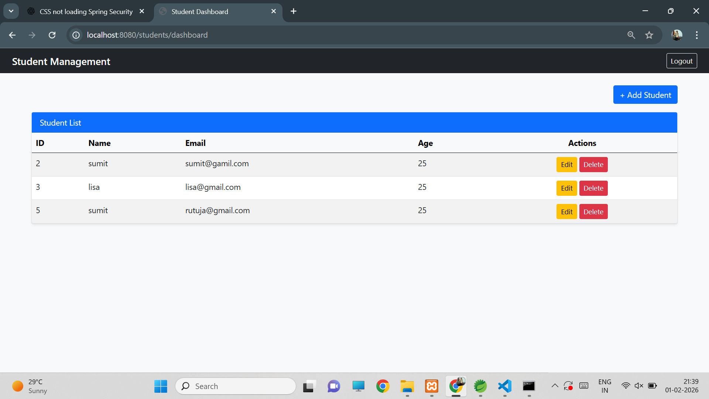
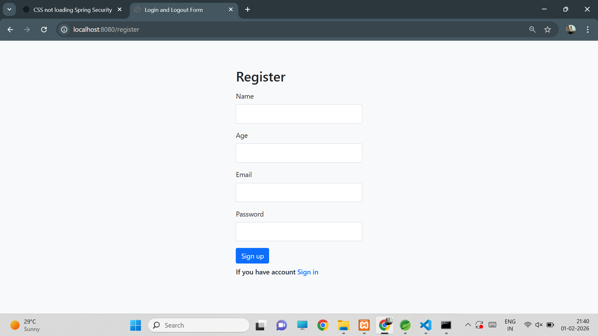
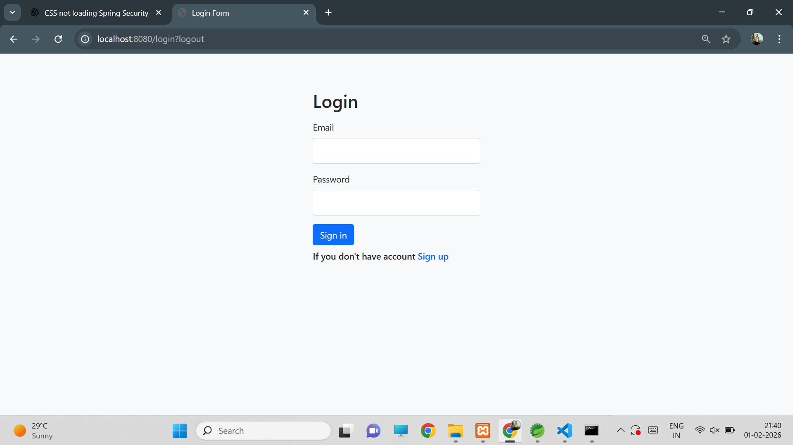
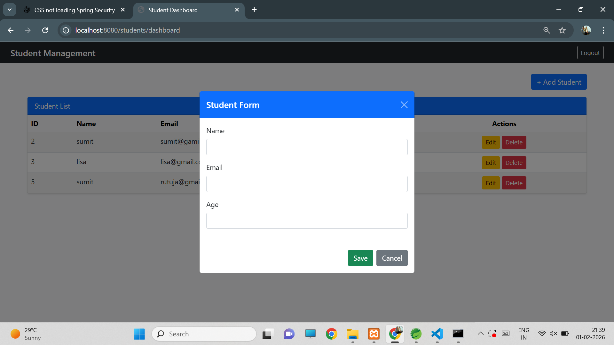

# student-management-system-spring-security

A Student Management System built using Spring Boot, Spring Security, JSP, and JPA.  The application supports user authentication, student CRUD operations, and a secure dashboard with a clean Bootstrap-based UI.

This is a web-based Student Management System developed using Spring Boot and JSP. 
The application provides secure login and registration functionality using Spring Security 
and allows authenticated users to perform CRUD operations on student records.

Students can be added, updated, viewed, and deleted through a clean dashboard interface 
built with Bootstrap. Data is stored and managed using Spring Data JPA with a relational database.

## 🚀 Live Demo
https://student-management-system-spring.onrender.com/login

#### 🛠️ Tech Stack
-  Java 17
-  Spring Boot
- Spring Security
- Spring Data JPA
- JSP & JSTL
- Bootstrap 5
- MySQL 
- Maven

#### ✨ Features
-  User Login & Logout (Spring Security)
-  Secure Dashboard Access
- Add Student (Modal Form)
- Edit Student Details
- Delete Student Records
- Duplicate Email Validation
- Database Integration (JPA & Hibernate)
- Clean and Responsive UI using Bootstrap

#### 📂 Project Structure
- controller  → Handles HTTP requests
- service     → Business logic
- repository  → Database access
- entity      → JPA entities
- jsp         → UI pages

🚀 How to Run
1. Clone the repository
2. Configure database in application.properties
3. Run the Spring Boot application
4. Access the app at http://localhost:8080/login

🎯 Learning Outcome
- Understanding Spring MVC architecture
- Implementing authentication & authorization
- Performing CRUD operations with JPA
- Integrating JSP with Spring Boot
- Building a real-world web application

#### Dashboard

#### Register

#### Login

#### Student form

#### Student update form

